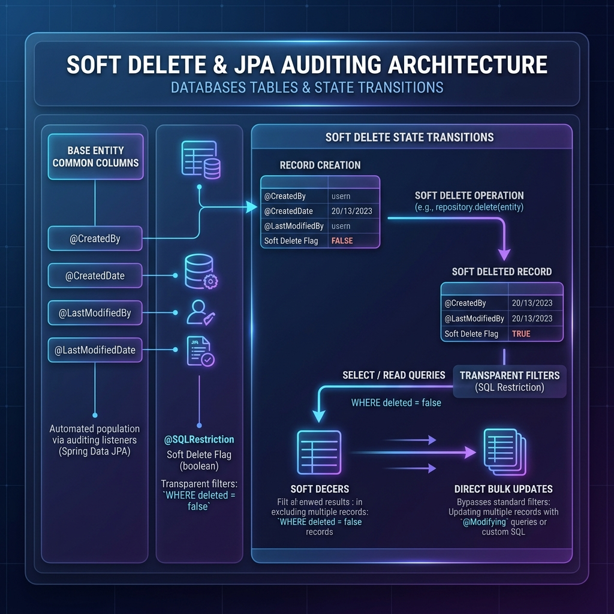

# TripGather (가칭: 일정 공유 & 동네 모임 어플) 🗺️ 🤝

<div align="center">
  
  <p><strong>나의 여권에 찍히는 스탬프, 우리 동네에서 시작하는 새로운 여행</strong></p>
</div>

## 🌟 프로젝트 개요
나만의 여행 일정이나 루틴을 기록 및 공유하고, 관심사가 맞는 사람들을 가볍게 모을 수 있는 **프리미엄 소셜 여정 플랫폼**입니다.
단순한 모임을 넘어 '라운지(Lounge)'에서의 발견, '비행 계획(Flight Plan)' 수립, 그리고 '내 탑승권(Boarding Pass)' 기반의 참여를 통해 일상을 여행처럼 즐길 수 있는 프리미엄한 경험을 제공합니다.

---

## 📸 주요 기능 (Key Features)

### 1. 라운지 (Lounge): 새로운 여정의 발견 🔍
- **[탐색 피드]** 내 주변에서 열리는 다양한 관심사 기반 여정을 '보딩 패스' 디자인의 카드 형태로 확인합니다.
- **[실시간 핫플레이스]** 인기 있는 여행지와 급상승 중인 모집 공고를 한눈에 파악합니다.

### 2. 비행 계획 (Flight Plan): 프리미엄 여정 설계 ✈️
- **[항공권 테마 플래너]** 여행 일정을 실제 항공권 디자인으로 구성하여 직관적이고 몰입감 있는 플래닝 기능을 제공합니다.
- **[나이트 플라이트 에디터]** 세련된 다크 테마의 에디터로 여행 경로(Flight Path)와 미션을 정교하게 설계합니다.

### 3. 크루와 챌린지 (Crew & Challenge) 🎫
- **[크루 시스템]** 단순 참여자가 아닌 함께 모험을 떠나는 '크루'로서의 소속감을 부여하며, 승인된 크루만 전용 콘텐츠에 접근할 수 있습니다.
- **[챌린지 & 스탬프]** 여정 중 주어지는 챌린지를 완료하고, 나만의 여권(Passport)에 디지털 스탬프를 수집합니다.

### 4. 무전과 갤러리 (Radio & Gallery) 💬
- **[무전 (Radio)]** 승인된 크루들만의 실시간 소통 채널로, 여행 중의 긴밀한 연결성을 보장합니다.
- **[갤러리 (Gallery)]** 여정의 순간들을 기록하고 공유하는 공간으로, 크루 전용 또는 선택적 공개가 가능합니다.

### 5. 여행 인사이트 (Travel Insight) 🤖
- **[AI 대시보드]** 사용자의 활동 데이터를 분석하여 여행 성향과 챌린지 달성률을 시각화하는 스마트 위젯을 제공합니다.

---

## 🏗️ 시스템 아키텍처 (Architecture)

### **[Backend] Layered Architecture & Clean Tech**
- **Spring Boot 3.3**: 견고한 백엔드 프레임워크 기반.
- **QueryDSL**: 복잡한 동적 쿼리를 타입 안정성 있게 처리.
- **Spring Security & JWT**: OAuth2(카카오, 네이버) 연동 및 토큰 기반 보안 강화.
- **WebSocket (STOMP)**: 저지연 실시간 채팅 처리.
- **MinIO**: 이미지 및 파일 업로드를 위한 고성능 스토리지.

### **[Database] Soft Delete & JPA Auditing Architecture**
- **BaseEntity**: 모든 주요 비즈니스 테이블(`users`, `gathering`, `itinerary`, `comment`, `gathering_post`)에 공통 생성/수정시점 및 삭제 상태(`deleted`) 속성을 완벽 상속합니다.
- **투명한 조회 필터링 (@SQLRestriction)**: 하이버네이트 최신 규격에 맞춘 가상 필터를 적용하여, `deleted = false`인 활성 상태의 로우만 쿼리 레벨에서 마법같이 자동 조회되도록 보장합니다.
- **벌크 논리 삭제 성능 튜닝**: 리포지토리 레벨에 direct UPDATE를 실행하는 `@Modifying` 메서드(`softDeleteById`)를 심어, 불필요한 `SELECT` 조회를 제거하고 최적의 처리 속도를 달성했습니다.

<p align="center">
  
</p>

### **[Frontend] ViewModel Pattern & Glassmorphism**
- **React 19 & Vite**: 빠른 개발 속도와 최신 리액트 기능 활용.
- **Custom Hook ViewModel**: UI 레이어와 비즈니스 로직(API 통신 등)을 완벽히 분리.
- **Premium Design System**: Vanilla CSS를 활용한 글래스모피즘 및 'Night Flight' 특화 UI.

---

## 🛠️ 기술 스택 (Tech Stack)

### **Backend**
- `Java 17`, `Spring Boot 3.3.4`
- `Spring Data JPA`, `QueryDSL`, `PostgreSQL`, `H2`
- `Spring Security`, `OAuth2 (Kakao/Naver)`, `JWT`
- `WebSocket`, `STOMP`, `SockJS`
- `MinIO` (S3 Compatible Storage)
- `JUnit 5`, `Mockito`, `JaCoCo` (Testing & Coverage)
- `Lombok`, `Flyway` (Migration)

### **Frontend**
- `JavaScript (ES6+)`, `React 19`
- `Vite`, `React Router 7`
- `Vanilla CSS` (Custom Design System)
- `Lucide React` (Icons)
- `StompJS`, `Axios`

---

## 🛡️ 품질 보증 및 안정성 (Quality & Stability)

프로젝트의 지속 가능성과 견고한 비즈니스 로직을 보장하기 위해 높은 수준의 테스트 표준을 유지합니다.

- **[JaCoCo 기반 커버리지 관리]**: 핵심 비즈니스 로직인 서비스 패키지의 라인 커버리지를 **80% 이상**으로 유지하도록 강제 설정되어 있습니다. (현재 전체 커버리지 **86%** 달성)
- **[엣지 케이스 검증]**: 포인트 잔액 부족 시 결제 차단 로직, 중복 가입 방지, 호스트 권한 우회 시도 등 발생 가능한 다양한 예외 상황에 대해 촘촘한 테스트 스위트를 구축했습니다.
- **[레이어드 아키텍처 테스트]**: Controller, Service, Repository 각 계층에 대해 Mockito를 활용한 정교한 유닛 테스트 및 통합 테스트를 수행합니다.

---

## 💡 트러블슈팅 및 기술적 도전

### **1. 다크 테마(Night Flight) 가독성 최적화**
- **문제**: 어두운 배경의 모달 에디터 내에서 입력창 배경과 텍스트가 구분되지 않는 이슈.
- **해결**: `--night-bg` 및 `--night-surface` 토큰을 정의하고, 전용 `input-night` 클래스를 구현하여 고대비 시인성을 확보했습니다.

### **2. 실시간 채팅 데이터 매핑**
- **문제**: 그룹 대화 중 송신자 정보를 효율적으로 표시하고, DM 파트너를 식별하는 로직의 복잡성.
- **해결**: `senderEmail` 기반의 캐싱 및 `useChatViewModel` 내 파트너 필터링 로직을 통해 렌더링 부하를 줄이고 로직의 간결함을 유지했습니다.

### **3. 서비스 레이어 테스트 안정성 확보**
- **문제**: 복잡한 연관 관계(Member-Gathering-Itinerary)로 인한 단위 테스트 시 NPE 발생 및 컴파일 오류 발생.
- **해결**: `@ExtendWith(MockitoExtension.class)`와 `BDDMockito`를 적극 활용하여 가짜 객체(Mock) 간의 상호작용을 정교하게 모델링하고, JaCoCo 리포트를 분석하여 누락된 예외 케이스를 100% 보강했습니다.

### **4. JPA Auditing 설정 격리와 WebMvcTest 통합 안정성**
- **문제**: 메인 Application 클래스에 `@EnableJpaAuditing`을 선언할 경우, JPA 메타모델을 띄우지 않는 컨트롤러 단위 슬라이스 테스트(`@WebMvcTest`)들이 구동에 실패하며 20여 개의 테스트가 전체 격파되는 이슈 발생.
- **해결**: `@EnableJpaAuditing` 설정을 별도의 `JpaConfig` 설정 빈으로 우아하게 분리 지정함으로써, 컨트롤러 모의 테스트와 실질적인 JPA 엔티티 감시 리스너 설정이 독립적이고 무결하게 작동하도록 격리 조치했습니다.

---

## 🚀 실행 가이드

### **Backend**
```bash
cd backend
./gradlew bootRun
```

### **Frontend**
```bash
cd frontend
npm install
npm run dev
```

---

<p align="center">
  <b>TripGather</b>: 나만의 여정을 기록하고 우리 동네의 새로운 친구를 만나보세요.
</p>
