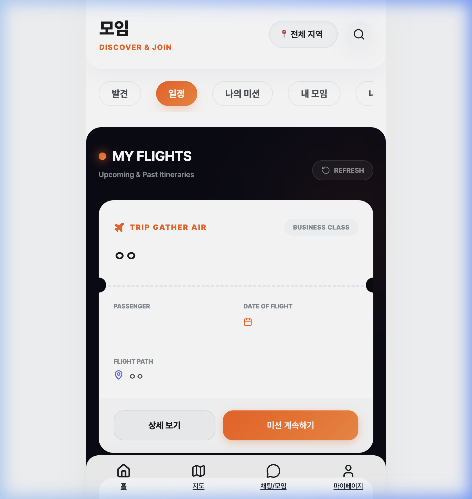
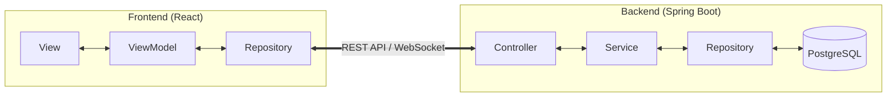

# TripGather (가칭: 일정 공유 & 동네 모임 어플) 🗺️ 🤝

<div align="center">
  
  <p><strong>나의 여권에 찍히는 스탬프, 우리 동네에서 시작하는 새로운 여행</strong></p>
</div>

## 🌟 프로젝트 개요
나만의 여행 일정이나 루틴을 기록 및 공유하고, 관심사가 맞는 사람들을 가볍게 모을 수 있는 **소셜 모임 플랫폼**입니다.
복잡한 절차 없이 카테고리별로 일정을 구경하고 모임에 참여할 수 있는 **직관적인 UI와 실시간 소통**을 제공합니다.

---

## 📸 주요 화면 (Key Features)

````carousel

**[발견]** 주변에서 열리는 다양한 모임과 여행 일정을 피드 형태로 구경합니다.
<!-- slide -->

**[상세보기]** 모임의 상세 위치, 일시, 호스트 정보를 확인하고 바로 참여 신청을 할 수 있습니다.
<!-- slide -->

**[지도 탐색]** 내 위치 기반으로 내 주변의 모임 핀을 시각적으로 확인합니다.
<!-- slide -->

**[실시간 채팅]** 참여된 모임원들과 그룹 채팅 및 1:1 DM을 통해 소통합니다.
<!-- slide -->

**[여행 일정]** 보딩 패스 스타일의 UI로 나만의 여행 계획을 관리합니다.
<!-- slide -->

**[나의 여권]** 참여한 미션과 챌린지 성취도에 따라 스탬프를 모으고 등급을 높입니다.
````

---

## 🏗️ 시스템 아키텍처 (Architecture)

### **[Backend] Layered Architecture**
백엔드는 유지보수와 확장을 고려하여 책임이 명확히 분리된 계층형 구조를 따릅니다.
- **Controller**: REST API 엔드포인트 노출 및 요청 검증.
- **Service**: 비즈니스 로직 처리 및 트랜잭션 관리.
- **Repository**: Spring Data JPA를 이용한 데이터 액세스.
- **Domain (Entity)**: JPA 엔티티 및 비즈니스 객체 모델.

### **[Frontend] MVVM (ViewModel) Pattern**
프론트엔드는 UI 로직과 데이터 관리 로직을 분리하기 위해 **Custom Hook 기반의 ViewModel** 패턴을 채택했습니다.
- **View (React Components)**: `Vanilla CSS`와 `Lucide-React` 아이콘을 활용한 프리미엄 글래스모피즘 디자인.
- **ViewModel (Custom Hooks)**: `useChatViewModel`, `useAuthViewModel` 등 로직을 캡슐화하여 UI 재사용성 증대.
- **Repository**: API 통신 및 데이터 매핑 로직 전담.



---

## 🛠️ 기술 스택 (Tech Stack)

### **Backend**
- **Core**: Java 17, Spring Boot 3.x
- **Persistence**: Spring Data JPA, PostgreSQL (Production), H2 (Local/Test)
- **Security**: Spring Security, JWT (Token-based Auth)
- **Messaging**: WebSocket (STOMP), SockJS
- **Documentation**: Swagger (OpenAPI 3.0)

### **Frontend**
- **Core**: React 18, Vite (Fast Bundling)
- **State**: React Context API, Custom Hooks
- **Styling**: Vanilla CSS (Global Design System)
- **Communication**: Axios, StompJS
- **Icons**: Lucide React

---

## 💡 주요 기술적 도전 및 트러블슈팅 (Troubleshooting)

### **1. 인증 정보 유지 (Auth Persistence)**
- **문제**: 새로고침 시 `AuthContext`의 상태가 초기화되어 로그인 상태가 해제되는 문제 발생.
- **해결**: `localStorage`에 JWT 토큰을 캐싱하고, 앱 초기화 시 토큰 유효성을 검증하여 Context 상태를 복구하는 로직을 구현했습니다.

### **2. 채팅 탭 UI 통합 및 렌더링 최적화**
- **문제**: 그룹 채팅과 1:1 DM 목록이 각기 다른 스타일로 구현되어 시각적 일관성이 부족하고, 데이터 지연 로딩 시 컴포넌트가 Crash되는 현상 발생.
- **해결**: 
    - 공통 `Card` 컴포넌트를 정의하여 리스트 UI를 통일(Premium Glass)했습니다.
    - `currentUser` 및 `gathering` 정보에 대한 **Null Guard** 패턴을 적용하여 데이터 로드 전후의 안정성을 확보했습니다.

### **3. 1:1 DM 파트너 식별 로직**
- **문제**: DM 목록 조회 시 로그인한 사용자가 송신자 혹은 수신자 둘 다 될 수 있어, 상대방의 정보를 동적으로 식별하는 데 복잡도가 높음.
- **해결**: Backend에서 송/수신자 관계를 정규화하여 처리하고, Frontend ViewModel에서 `otherUser` 필터를 통해 일관된 데이터를 뷰에 전달하도록 개선했습니다.

---

## 🚀 실행 가이드 (Quick Start)

상세 내용은 **[GUIDE.md](./GUIDE.md)**를 참고하세요.

### **Backend**
```bash
cd backend
./gradlew bootRun
```

### **Frontend**
```bash
cd frontend
npm install
npm run dev
```
