# TripGather (가칭: 일정 공유 & 동네 모임 어플) 🗺️ 🤝

<div align="center">
  
  <br />
  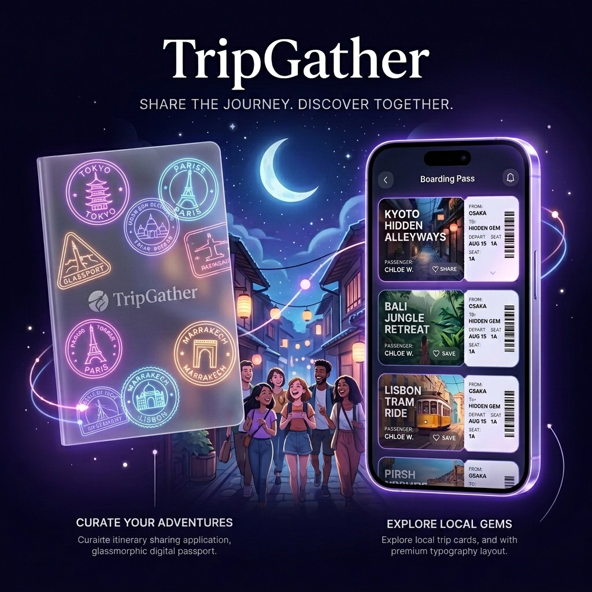
  <p><strong>"나의 여권에 찍히는 스탬프, 우리 동네에서 시작하는 새로운 여행"</strong></p>
</div>

## 🌟 프로젝트 개요
나만의 여행 일정이나 루틴을 기록 및 공유하고, 관심사가 맞는 사람들을 가볍게 모을 수 있는 **프리미엄 소셜 여정 플랫폼**입니다.
단순한 모임을 넘어 '라운지(Lounge)'에서의 발견, '비행 계획(Flight Plan)' 수립, 그리고 '내 탑승권(Boarding Pass)' 기반의 참여를 통해 일상을 여행처럼 즐길 수 있는 프리미엄한 경험을 제공합니다.

---

## 📸 주요 기능 (Key Features)

### 1. 라운지 (Lounge): 새로운 여정의 발견 🔍
- **[탐색 피드]** 내 주변에서 열리는 다양한 관심사 기반 여정을 '보딩 패스' 디자인의 카드 형태로 확인합니다.
- **[실시간 핫플레이스]** 인기 있는 여행지와 급상승 중인 모집 공고를 한눈에 파악합니다.

### 2. 비행 계획 (Flight Plan): 프리미엄 여정 설계 ✈️
- **[항공권 테마 플래너]** 여행 일정을 실제 항공권 디자인으로 구성하여 직관적이고 몰입감 있는 플래닝 기능을 제공합니다.
- **[나이트 플라이트 에디터]** 세련된 다크 테마의 에디터로 여행 경로(Flight Path)와 미션을 정교하게 설계합니다.

### 3. 크루와 챌린지 (Crew & Challenge) 🎫
- **[크루 시스템]** 단순 참여자가 아닌 함께 모험을 떠나는 '크루'로서의 소속감을 부여하며, 승인된 크루만 전용 콘텐츠에 접근할 수 있습니다.
- **[챌린지 & 스탬프]** 여정 중 주어지는 챌린지를 완료하고, 나만의 여권(Passport)에 디지털 스탬프를 수집합니다.

### 4. 무전과 갤러리 (Radio & Gallery) 💬
- **[무전 (Radio)]** 승인된 크루들만의 실시간 소통 채널로, 여행 중의 긴밀한 연결성을 보장합니다.
- **[갤러리 (Gallery)]** 여정의 순간들을 기록하고 공유하는 공간으로, 크루 전용 또는 선택적 공개가 가능합니다.

### 5. 여행 인사이트 (Travel Insight) 🤖
- **[AI 대시보드]** 사용자의 활동 데이터를 분석하여 여행 성향과 챌린지 달성률을 시각화하는 스마트 위젯을 제공합니다.

---

## 🏗️ 시스템 아키텍처 및 상세 개발 가이드

TripGather의 보다 정교한 아키텍처 설계, 데이터 모델(ERD), 컴포넌트 구조, 로컬 상세 실행 방법 및 문제 해결 가이드는 아래의 상세 문서를 확인해 주세요.

👉 **[상세 시스템 아키텍처 및 개발 가이드 바로가기 (ARCHITECTURE_AND_GUIDE.md)](./docs/ARCHITECTURE_AND_GUIDE.md)**

---

## 🗺️ 사용자 경험 (UX) & 화면 흐름도 (Screen Flow)

TripGather는 사용자가 우리 동네의 모임을 발견하는 첫 순간부터, 일정을 계획하고, 크루들과 실시간 소통을 하며 미션을 완료해 스탬프를 쌓아 나가는 모든 순간을 **여정(Journey)**이라는 프리미엄 UX 프레임워크로 감쌉니다.

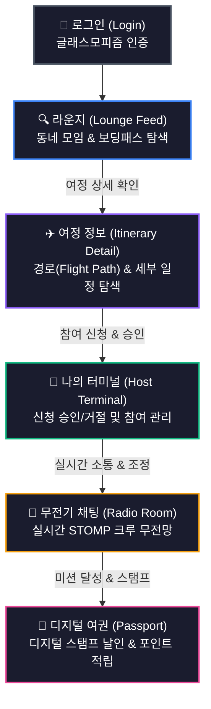

### 📱 실제 서비스 화면 갤러리 (UX Gallery)

| 🔑 1. 로그인 화면 (`login.png`) | 🔍 2. 라운지 탐색 피드 (`feed.png`) |
| :---: | :---: |
| 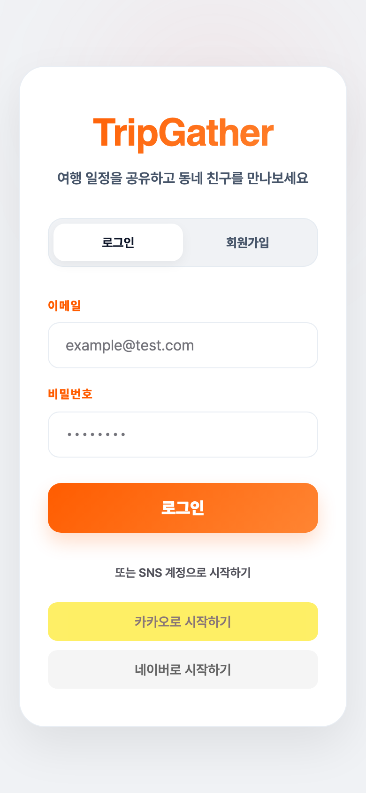 | 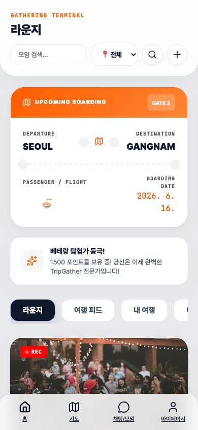 |
| 프리미엄 글래스모피즘을 적용한 로그인 화면 | 내 주변 여정을 보딩패스 카드로 멋지게 탐색합니다. |

| ✈️ 3. 감각적 여정 상세 (`detail.png`) | ✍️ 4. 모임 개설 에디터 (`create_gathering.png`) |
| :---: | :---: |
| 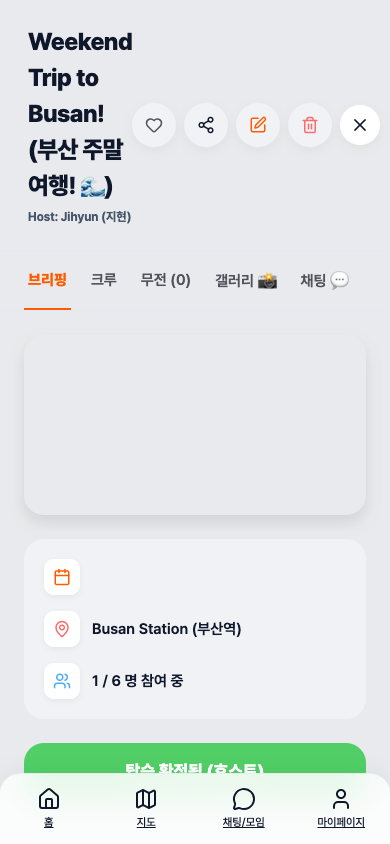 | 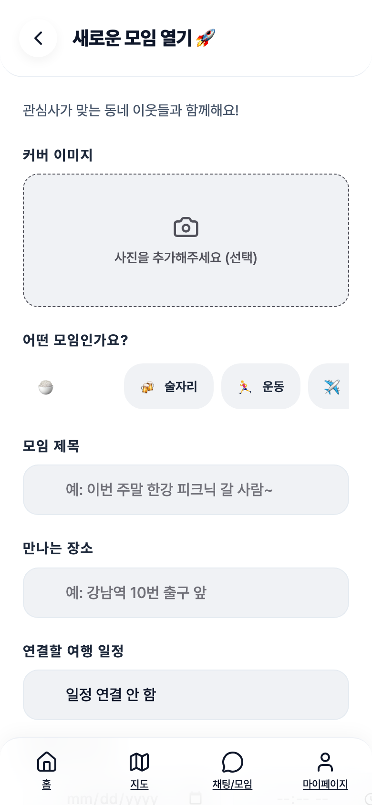 |
| 이동 경로와 시간대별 일정을 비행 테마로 감상합니다. | 모임을 주최하기 위해 상세 조건과 일정을 입력합니다. |

| 🌌 5. 나이트 플라이트 에디터 (`itinerary_editor.png`) | 🎫 6. 탑승권 & 여행 허브 (`trip_hub.png`) |
| :---: | :---: |
| 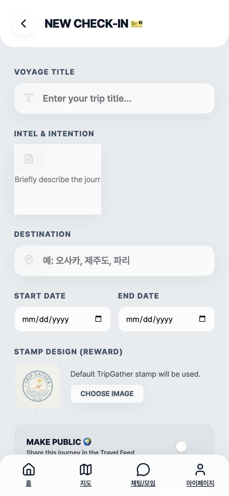 | 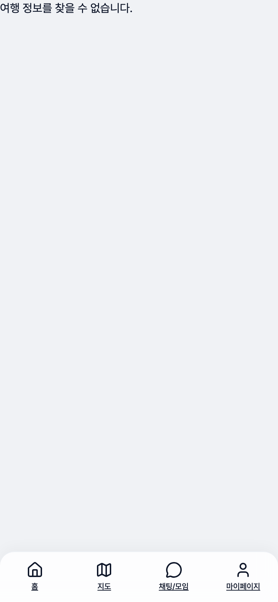 |
| 세련된 다크 테마 에디터로 여행 경로를 설계합니다. | 내 탑승권(Boarding Pass) 기반의 참여 정보를 확인합니다. |

| 💬 7. 크루 무전 실시간 채팅 (`chat.png`) | 📔 8. 미션 달성 여권 스탬프 (`passport.png`) |
| :---: | :---: |
| 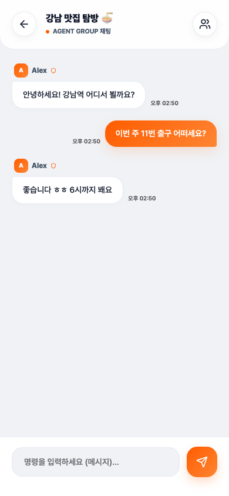 | 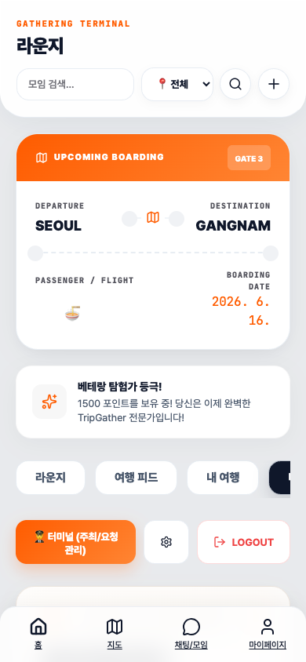 |
| STOMP 기반의 무전 대화망으로 크루들과 대화합니다. | 달성한 크루 미션을 디지털 스탬프로 기록합니다. |

| 🛂 9. 나의 터미널 호스트 관리 (`my_gatherings.png`) | 🗺️ 10. 지도 기반 여정 탐색 (`map.png`) |
| :---: | :---: |
| 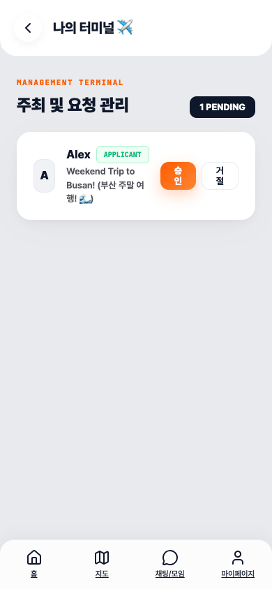 | 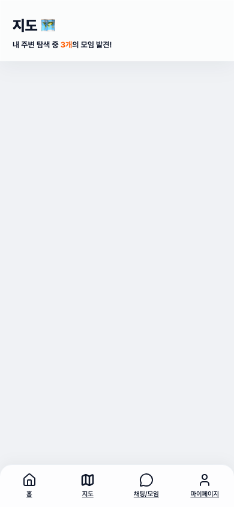 |
| 참가 신청을 승인/거절하고 크루들을 정교하게 제어합니다. | 카카오 맵 API를 활용해 주변 모임을 지도로 탐색합니다. |

---

## 🛠️ 핵심 기술 스택 (Tech Stack)

### **Backend**
- `Java 17`, `Spring Boot 3.3.4`
- `Spring Data JPA`, `QueryDSL`, `PostgreSQL`, `H2`
- `Spring Security`, `OAuth2 (Kakao/Naver)`, `JWT`
- `WebSocket`, `STOMP`
- `MinIO` (S3 호환 스토리지) / `Local Disk Storage`
- `JUnit 5`, `Mockito`, `JaCoCo`

### **Frontend**
- `JavaScript (ES6+)`, `React 19`
- `Vite`, `React Router 7`
- `Vanilla CSS` (Custom Glassmorphism 디자인 시스템)
- `Lucide React`
- `StompJS`, `Axios`

---

## 🛡️ 품질 보증 및 안정성 (Quality & Stability)

프로젝트의 지속 가능성과 견고한 비즈니스 로직을 보장하기 위해 높은 수준의 테스트 표준을 유지합니다.

- **[JaCoCo 기반 커버리지 관리]**: 핵심 비즈니스 로직인 서비스 패키지의 라인 커버리지를 **80% 이상**으로 유지하도록 강제 설정되어 있습니다. (현재 전체 커버리지 **86%** 달성)
- **[엣지 케이스 검증]**: 포인트 잔액 부족 시 결제 차단 로직, 중복 가입 방지, 호스트 권한 우회 시도 등 발생 가능한 다양한 예외 상황에 대해 촘촘한 테스트 스위트를 구축했습니다.
- **[레이어드 아키텍처 테스트]**: Controller, Service, Repository 각 계층에 대해 Mockito를 활용한 정교한 유닛 테스트 및 통합 테스트를 수행합니다.

---

## 🚀 빠른 로컬 실행 가이드

### **1. Backend**
```bash
cd backend
./gradlew bootRun -Dstorage.type=local
```
*(H2 인메모리 DB 및 로컬 디스크 파일 업로드가 자동으로 활성화됩니다.)*

### **2. Frontend**
```bash
cd frontend
npm install
npm run dev
```

---

<p align="center">
  <b>TripGather</b>: 나만의 여정을 기록하고 우리 동네의 새로운 친구를 만나보세요.
</p>
