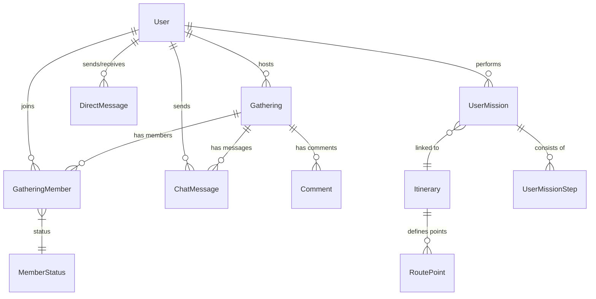

# TripGather (가칭: 일정 공유 & 동네 모임 어플) 🗺️ 🤝


## 프로젝트 개요
나만의 여행 일정이나 루틴을 기록 및 공유하고, 관심사가 맞는 사람들을 가볍게 모을 수 있는 **소셜 모임 플랫폼**입니다.
복잡한 절차 없이 카테고리별로 일정을 구경하고 모임에 참여할 수 있는 **직관적인 UI와 실시간 소통**을 제공합니다.

---

## 📸 주요 화면 (Features)

````carousel

**[발견]** 주변에서 열리는 다양한 모임과 여행 일정을 피드 형태로 구경합니다.
<!-- slide -->

**[상세보기]** 모임의 상세 위치, 일시, 호스트 정보를 확인하고 바로 참여 신청을 할 수 있습니다.
<!-- slide -->

**[지도 탐색]** 내 위치 기반으로 내 주변의 모임 핀을 시각적으로 확인합니다.
<!-- slide -->

**[실시간 채팅]** 참여된 모임원들과 그룹 채팅 및 1:1 DM을 통해 소통합니다.
<!-- slide -->

**[여행 일정]** 보딩 패스 스타일의 UI로 나만의 여행 계획을 관리합니다.
<!-- slide -->

**[나의 여권]** 참여한 미션과 챌린지 성취도에 따라 스탬프를 모으고 등급을 높입니다.
````

---

## 📊 데이터베이스 설계 (ERD)



---

## 🛠️ 기술 스택 (Tech Stack)

### Backend
- **Java 17 / Spring Boot 3.x**
- **Spring Data JPA** (PostgreSQL / H2)
- **Spring Security & JWT** (인증/인가)
- **WebSocket & STOMP** (실시간 채팅)
- **Swagger (OpenAPI 3.0)** - [http://localhost:8080/swagger-ui.html](http://localhost:8080/swagger-ui.html)

### Frontend
- **React 18 / Vite**
- **Vanilla CSS** (Premium Glassmorphism Theme)
- **Lucide React** (Icons)
- **Kakao Map API** (Location Services)

---

## 🚀 실행 방법 (Quick Start)

상세한 환경 설정 및 가이드는 **[GUIDE.md](file:///Users/juhee/IdeaProjects/TripGather/GUIDE.md)**를 참고하세요.

### Backend
```bash
cd backend
./gradlew bootRun
```

### Frontend
```bash
cd frontend
npm install
npm run dev
```

---

## 📂 프로젝트 구조

```text
TripGather/
├── backend/                  # Spring Boot API Server
│   ├── domain/               # JPA Entities
│   ├── repository/           # Data Access Layer
│   ├── service/              # Business Logic
│   └── controller/           # REST API Endpoints
└── frontend/                 # React Single Page App
    ├── components/           # Reusable UI (Atomic Design)
    ├── pages/                # Page-level Components
    └── contexts/             # Global State (Auth, Theme)
```
