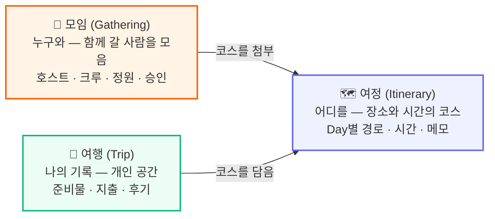
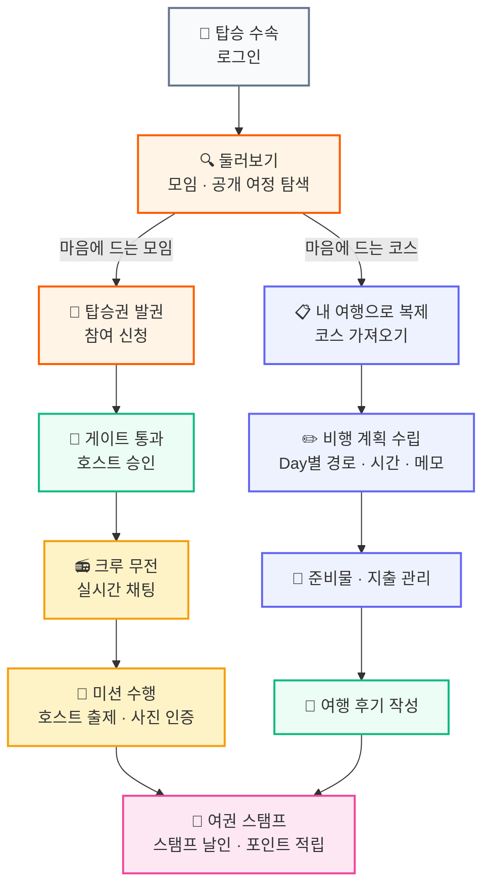

# TripGather ✈️ 🗺️

<div align="center">
  
  <br />
  <p><strong>"나의 여권에 찍히는 스탬프, 우리 동네에서 시작하는 새로운 여행"</strong></p>
  <p>
    
    
    
    
    
    
  </p>
</div>

---

## 🌟 이런 서비스입니다

퇴근길에 같이 러닝할 사람을 찾고 싶을 때, 주말 제주 코스를 짜고 싶을 때, 다녀온 여행을 기록으로 남기고 싶을 때 —
**TripGather는 이 세 가지를 하나의 여행 메타포로 묶습니다.**

탑승 수속하듯 모임에 참여하고, 항공권처럼 생긴 일정표로 코스를 짜고, 다녀온 곳마다 여권에 스탬프를 찍습니다.

---

## 🧭 핵심 개념 3가지

TripGather를 이해하는 가장 빠른 길은 **모임 · 여정 · 여행** 세 개념의 관계를 아는 것입니다.


```mermaid
graph LR
    G["🎫 모임 (Gathering)<br/>누구와 — 함께 갈 사람을 모음<br/>호스트 · 크루 · 정원 · 승인"]
    I["🗺️ 여정 (Itinerary)<br/>어디를 — 장소와 시간의 코스<br/>Day별 경로 · 시간 · 메모"]
    T["🧳 여행 (Trip)<br/>나의 기록 — 개인 공간<br/>준비물 · 지출 · 후기"]

    G -->|코스를 첨부| I
    T -->|코스를 담음| I

    style G fill:#FFF4E6,stroke:#FF5C00,stroke-width:2px
    style I fill:#EEF2FF,stroke:#6366F1,stroke-width:2px
    style T fill:#ECFDF5,stroke:#10B981,stroke-width:2px
```

| | 무엇을 답하나 | 누구의 것 | 예시 |
|:--|:--|:--|:--|
| 🎫 **모임** | **누구와** 갈까 | 모두에게 공개 | "토요일 한강 러닝 같이 뛰실 분" |
| 🗺️ **여정** | **어디를** 갈까 | 공개/비공개 선택 | "제주 2박 3일 먹방 코스" |
| 🧳 **여행** | 내가 **무엇을** 했나 | 나만 | "8월 교토 — 준비물, 지출, 후기" |

> **여정(Itinerary)이 가운데에 있습니다.** 같은 코스를 모임에 붙이면 *함께 가는 길*이 되고,
> 내 여행에 담으면 *혼자 기록하는 길*이 됩니다. 남의 공개 여정을 내 여행으로 복제해 올 수도 있습니다.

---

## 🛫 사용자 여정 (User Journey)


```mermaid
graph TD
    A["🔑 탑승 수속<br/>로그인"] --> B["🔍 둘러보기<br/>모임 · 공개 여정 탐색"]

    B -->|마음에 드는 모임| C["🎫 탑승권 발권<br/>참여 신청"]
    B -->|마음에 드는 코스| D["📋 내 여행으로 복제<br/>코스 가져오기"]

    C --> E["🛂 게이트 통과<br/>호스트 승인"]
    E --> F["📻 크루 무전<br/>실시간 채팅"]
    F --> G["🎯 미션 수행<br/>호스트 출제 · 사진 인증"]

    D --> H["✏️ 비행 계획 수립<br/>Day별 경로 · 시간 · 메모"]
    H --> I["🎒 준비물 · 지출 관리"]

    G --> J["📔 여권 스탬프<br/>스탬프 날인 · 포인트 적립"]
    I --> K["📝 여행 후기 작성"]
    K --> J

    style A fill:#F8FAFC,stroke:#64748B,stroke-width:2px
    style B fill:#FFF4E6,stroke:#FF5C00,stroke-width:2px
    style C fill:#FFF4E6,stroke:#FF5C00,stroke-width:2px
    style E fill:#ECFDF5,stroke:#10B981,stroke-width:2px
    style F fill:#FEF3C7,stroke:#F59E0B,stroke-width:2px
    style G fill:#FEF3C7,stroke:#F59E0B,stroke-width:2px
    style D fill:#EEF2FF,stroke:#6366F1,stroke-width:2px
    style H fill:#EEF2FF,stroke:#6366F1,stroke-width:2px
    style I fill:#EEF2FF,stroke:#6366F1,stroke-width:2px
    style J fill:#FCE7F3,stroke:#EC4899,stroke-width:2px
    style K fill:#ECFDF5,stroke:#10B981,stroke-width:2px
```

**두 갈래로 갈립니다.** 왼쪽은 *함께 가는 길*(모임 → 승인 → 무전 → 미션), 오른쪽은 *혼자 준비하는 길*(복제 → 계획 → 준비물). 두 길 모두 **여권 스탬프**로 모입니다.

> 📐 화면 구성(탭) 개편안과 정기 모임 도입 제안은 **[UX 워크플로우 분석 문서](./docs/UX_WORKFLOW.md)** 를 참고하세요.

---

## 📸 주요 기능

### 1. 둘러보기 (Lounge) 🔍
- **보딩패스 카드 피드** — 내 주변 모임을 항공권 디자인 카드로 탐색합니다.
- **지역 · 키워드 · 모집중 필터** — QueryDSL 동적 쿼리로 조합 검색하고, 20건씩 페이지로 이어 봅니다.
- **찜하기** — 관심 모임을 모아둡니다.

### 2. 비행 계획 (Flight Plan) ✈️
- **항공권 테마 플래너** — Day별 경로를 ARR/DEP 시간 슬라이더로 설계합니다.
- **지점별 메모** — "오픈런 필요", "예약번호 1234" 같은 메모를 장소마다 남깁니다.
- **드래그 순서 변경** — 전용 핸들로 경로 순서를 바꿉니다.
- **준비물 체크리스트** — 카테고리별 기본 세트를 제공하고 달성률(%)을 계산합니다.

### 3. 크루와 미션 (Crew & Mission) 🎫
- **승인제 크루** — 호스트가 승인한 크루만 전용 콘텐츠에 접근합니다.
- **호스트 출제 미션** — 사진 인증을 받아 심사하고, 승인 시 포인트와 스탬프를 함께 지급합니다.
- **N빵 정산** — 여행 지출을 기록하고 인원수로 나눕니다.

### 4. 무전과 여권 (Radio & Passport) 📻
- **크루 무전** — WebSocket STOMP 기반 실시간 대화, 최신 50건부터 커서 페이징으로 과거를 불러옵니다.
- **디지털 여권** — 미션으로 모은 스탬프와 포인트 이력을 여권 형태로 보관합니다.

---

## 📸 실제 화면

<div align="center">
  <h3>🗺️ 둘러보기 — 모임 탐색 피드</h3>
  
  <p><i>글래스모피즘 기반 보딩패스 카드로 주변 모임을 탐색합니다.</i></p>
</div>

<br />

<div align="center">
  <h3>🤝 동행 모집 — 정원과 호스트 한눈에</h3>
  
  <p><i>목적지 태그, 참여 정원 현황, 호스트 프로필을 함께 보여줍니다.</i></p>
</div>

<br />

<div align="center">
  <h3>📅 비행 계획 — 일정과 준비물</h3>
  
  <p><i>일자별 이동 타임라인과 준비물 달성률을 관리합니다.</i></p>
</div>

<br />

<div align="center">
  <h3>📔 여권 — 스탬프와 리워드</h3>
  
  <p><i>달성 배지, 디지털 스탬프, 포인트 이력을 제공합니다.</i></p>
</div>

---

## 🛠️ 기술 스택

### Backend
- `Java 17`, `Spring Boot 3.3.4`
- `Spring Data JPA`, `QueryDSL`, `PostgreSQL`(운영) / `H2`(로컬)
- `Flyway` 마이그레이션 (V1 ~ V13)
- `Spring Security`, `OAuth2 (Kakao/Naver)`, `JWT`
- `WebSocket` + `STOMP` (크루 무전), `SSE` (알림)
- `MinIO` / 로컬 디스크 스토리지 전략 분리
- `JUnit 5`, `Mockito`, `JaCoCo`

### Frontend
- `React 19`, `Vite 7`, `React Router 7`
- `Vanilla CSS` — 글래스모피즘 디자인 토큰 시스템
- `StompJS`, `Axios`, `react-kakao-maps-sdk`

---

## 🛡️ 품질 지표

- **테스트 439개 전수 통과** — 서비스 · 컨트롤러 · 리포지토리 · 통합 테스트
- **라인 커버리지 93.4% / 브랜치 73.1%** — DTO·도메인·설정을 제외한 비즈니스 로직 기준
- **커버리지 게이트 강제** — 클래스별 최소 80% 규칙이 `check` 태스크에 연결되어 `./gradlew build`와 CI에서 실제로 검증됩니다
- **스키마 드리프트 방지** — `SchemaValidationTest`가 운영과 동일한 `ddl-auto=validate` 모드로 컨텍스트를 띄워, 엔티티에만 추가되고 마이그레이션에 빠진 컬럼을 배포 전에 잡아냅니다

---

## 🚀 로컬 실행

### 1. Backend

```bash
cd backend
./gradlew bootRun -Dstorage.type=local
```

H2 인메모리 DB와 로컬 디스크 업로드가 활성화됩니다. 기본 포트는 `8080`이며, 바꾸려면 `SERVER_PORT=8081`을 앞에 붙입니다.

### 2. Frontend

```bash
cd frontend
npm install
npm run dev
```

`http://localhost:5173` 에서 열립니다. 백엔드 주소를 바꾸려면 `frontend/.env` 의 `VITE_API_BASE_URL` 을 수정하세요.

### 3. 테스트 계정

로컬 실행 시 시드 데이터가 자동으로 들어갑니다. 두 계정 모두 비밀번호는 `pass1234` 입니다.

| 이메일 | 이름 | 비고 |
|:--|:--|:--|
| `jihyun@test.com` | Jihyun (지현) | 모임 호스트 — 승인 관리 화면까지 볼 수 있습니다 |
| `alex@test.com` | Alex | 일반 크루 |

---

## 📚 더 읽을거리

- **[UX 워크플로우 분석 및 개선 제안](./docs/UX_WORKFLOW.md)** — 현재 화면 구성의 문제와 개편안, 정기 모임 도입 제안
- **[아키텍처 및 개발 가이드](./docs/ARCHITECTURE_AND_GUIDE.md)** — 계층 구조, ERD, 컴포넌트 설계, 트러블슈팅

---

<p align="center">
  <b>TripGather</b> — 오늘의 퇴근길도, 다음 달 제주도 여행도 하나의 여정으로. ✈️
</p>
