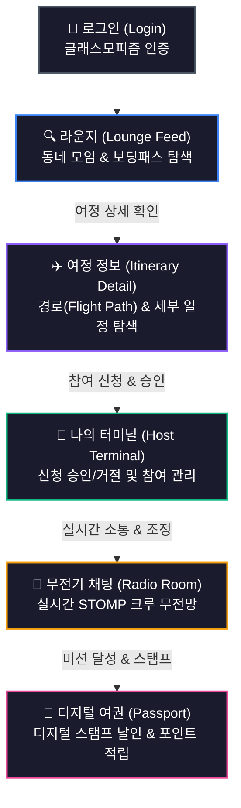

# TripGather (일정 공유 & 동행 소셜 플랫폼) 🗺️ 🤝

<div align="center">
  
  <br />
  <p><strong>"나의 여권에 찍히는 스탬프, 우리 동네에서 시작하는 새로운 여행"</strong></p>
  <p>
    
    
    
    
    
  </p>
</div>

---

## 🌟 프로젝트 개요

TripGather는 나만의 여행 일정이나 코스를 공유하고 관심사가 맞는 동행을 가볍게 모을 수 있는 **프리미엄 소셜 여정 플랫폼**입니다.
단순한 모임을 넘어 '라운지(Lounge)'에서의 여정 탐색, '비행 계획(Flight Plan)' 수립, 그리고 '스탬프 여권(Passport)' 기반의 혜택 및 미션 달성을 통해 일상을 여행처럼 즐길 수 있는 특별한 경험을 제공합니다.

---

## 📸 실제 서비스 UI 갤러리 (Live Visual Showcase)

<div align="center">
  <h3>🗺️ 1. 메인 여정 랜딩 & 탐색 피드 (Lounge Discovery)</h3>
  
  <p><i>프리미엄 글래스모피즘 디자인과 실시간 인기 여행 코스 및 보딩패스 카드를 제공합니다.</i></p>
</div>

<br />

<div align="center">
  <h3>🤝 2. 관심사 기반 동행 모집 (Gathering Matching)</h3>
  
  <p><i>목적지별 모임 태그, 참여 정원 현황 및 호스트 프로필을 직관적으로 탐색합니다.</i></p>
</div>

<br />

<div align="center">
  <h3>📅 3. 스마트 일정 플래너 & 준비물 체크리스트 (Itinerary & Checklist)</h3>
  
  <p><i>일자별 이동 타임라인과 실시간 준비물 달성률(%)을 시각적으로 관리합니다.</i></p>
</div>

<br />

<div align="center">
  <h3>📔 4. 여권 스탬프 & 마이페이지 대시보드 (Passport & Profile)</h3>
  
  <p><i>여행 달성 레벨 배지, 여권 스타일 디지털 스탬프 수집 및 리워드 포인트 이력을 제공합니다.</i></p>
</div>

---

## 📸 주요 기능 (Key Features)

### 1. 라운지 (Lounge): 새로운 여정의 발견 🔍
- **[탐색 피드]** 내 주변에서 열리는 다양한 관심사 기반 여정을 '보딩 패스' 디자인의 카드 형태로 확인합니다.
- **[실시간 핫플레이스]** 인기 있는 여행지와 급상승 중인 모집 공고를 한눈에 파악합니다.

### 2. 비행 계획 (Flight Plan): 프리미엄 여정 설계 ✈️
- **[항공권 테마 플래너]** 여행 일정을 실제 항공권 디자인으로 구성하여 직관적이고 몰입감 있는 플래닝 기능을 제공합니다.
- **[준비물 체크리스트]** 여행 카테고리별 준비물을 관리하고 달성률(%)을 실시간 계산합니다.

### 3. 크루와 챌린지 (Crew & Challenge) 🎫
- **[크루 시스템]** 단순 참여자가 아닌 함께 모험을 떠나는 '크루'로서의 소속감을 부여하며, 승인된 크루만 전용 콘텐츠에 접근할 수 있습니다.
- **[디지털 여권 & 스탬프]** 여정 중 주어지는 챌린지를 완료하고, 나만의 여권(Passport)에 디지털 스탬프를 수집합니다.

### 4. 무전과 갤러리 (Radio & Gallery) 💬
- **[크루 무전 (Radio)]** WebSocket STOMP 기반 승인 크루 전용 실시간 대화망을 지원합니다.
- **[여행 갤러리]** 여정의 순간들을 기록하고 공유하는 공간을 제공합니다.

---

## 🏗️ 사용자 경험 (UX) & 화면 흐름도 (Screen Flow)


```mermaid
graph TD
    A["🔑 로그인 (Login)<br>글래스모피즘 인증"] --> B["🔍 라운지 (Lounge Feed)<br>동네 모임 & 보딩패스 탐색"]
    B -->|여정 상세 확인| C["✈️ 여정 정보 (Itinerary Detail)<br>경로(Flight Path) & 세부 일정 탐색"]
    C -->|참여 신청 & 승인| D["🛂 나의 터미널 (Host Terminal)<br>신청 승인/거절 및 참여 관리"]
    D -->|실시간 소통 & 조정| E["💬 무전기 채팅 (Radio Room)<br>실시간 STOMP 크루 무전망"]
    E -->|미션 달성 & 스탬프| F["📔 디지털 여권 (Passport)<br>디지털 스탬프 날인 & 포인트 적립"]
    
    style A fill:#1a1c2e,stroke:#4b5563,stroke-width:2px,color:#fff
    style B fill:#1a1c2e,stroke:#3b82f6,stroke-width:2px,color:#fff
    style C fill:#1a1c2e,stroke:#8b5cf6,stroke-width:2px,color:#fff
    style D fill:#1a1c2e,stroke:#10b981,stroke-width:2px,color:#fff
    style E fill:#1a1c2e,stroke:#f59e0b,stroke-width:2px,color:#fff
    style F fill:#1a1c2e,stroke:#ec4899,stroke-width:2px,color:#fff
```

---

## 🛠️ 핵심 기술 스택 (Tech Stack)

### **Backend**
- `Java 17`, `Spring Boot 3.3.4`
- `Spring Data JPA`, `QueryDSL`, `PostgreSQL`, `H2`
- `Spring Security`, `OAuth2 (Kakao/Naver)`, `JWT`
- `WebSocket`, `STOMP`
- `JUnit 5`, `Mockito`, `JaCoCo` (347개 테스트 전수 통과)

### **Frontend**
- `JavaScript (ES6+)`, `React 19`
- `Vite`, `React Router 7`
- `Vanilla CSS` (Glassmorphism 디자인 시스템)
- `StompJS`, `Axios`

---

## 🛡️ 품질 보증 및 검증 지표 (Quality & Reliability)

프로젝트의 지속 가능성과 견고한 비즈니스 로직을 보장하기 위해 높은 수준의 테스트 표준을 유지합니다.

- **[JaCoCo 기반 커버리지 관리]**: 로직을 담는 전 계층(`service`, `controller`, `security`, `exception`)에 두 가지 기준을 강제합니다 — **클래스당 라인 80% 이상**, 그리고 **전체 분기(branch) 80% 이상**. 이 검증(`jacocoTestCoverageVerification`)은 `check`/`build` 수명주기에 연결되어 기준 미달 시 빌드가 실패합니다. (2026-09-11 기준 라인 **96.8%** (1,941/2,006), 분기 **80.4%** (775/964), 테스트 550개 전부 통과)

| 계층 | 라인 커버리지 | 분기 커버리지 |
|:--|--:|--:|
| `controller` | 100% (276/276) | 81.7% (85/104) |
| `exception` | 100% (49/49) | 100% (4/4) |
| `security` (oauth 포함) | 96.6% (143/148) | 96.3% (52/54) |
| `service` (storage 포함) | 95.7% (1,327/1,387) | 79.5% (628/790) |

  분기 기준을 함께 두는 이유는, 라인 커버리지는 메서드를 한 번만 호출해도 채워지지만 조건문의 반대 경로는 검증되지 않은 채 남기 때문입니다. 측정 대상에서 빠지는 것은 QueryDSL 생성 클래스, 부트스트랩 클래스, 그리고 자체 로직이 없는 `dto`/`domain`/`config`/`repository`뿐입니다.
- **[인증 경로 중점 검증]**: 회귀 시 영향 범위가 가장 넓은 인증 경로를 우선 보강했습니다. 소셜 로그인(카카오/네이버), JWT 필터, STOMP 연결 인증을 0%~66% 구간에서 **전부 100%**로 끌어올렸으며, 특히 채팅/DM은 클라이언트가 보낸 `senderEmail`을 신뢰하지 않고 인증 주체만 사용하는지(타인 사칭 방지)를 명시적으로 검증합니다.
- **[엣지 케이스 검증]**: 포인트 잔액 부족 시 결제 차단 로직, 중복 가입 방지, 호스트 권한 우회 시도 등 발생 가능한 다양한 예외 상황에 대해 촘촘한 테스트 스위트를 구축했습니다.
- **[레이어드 아키텍처 테스트]**: Controller, Service, Repository 각 계층에 대해 Mockito를 활용한 정교한 유닛 테스트 및 통합 테스트를 수행합니다.

---

## 🚀 빠른 로컬 실행 가이드

### **1. Backend 실행**
```bash
cd backend
./gradlew bootRun -Dstorage.type=local
```
*(H2 인메모리 DB 및 로컬 디스크 파일 업로드가 자동으로 활성화됩니다.)*

### **2. Frontend 실행**
```bash
cd frontend
npm install
npm run dev
```

---

<p align="center">
  <b>TripGather</b>: 나만의 여정을 기록하고 우리 동네의 새로운 동행을 만나보세요. ✈️
</p>
