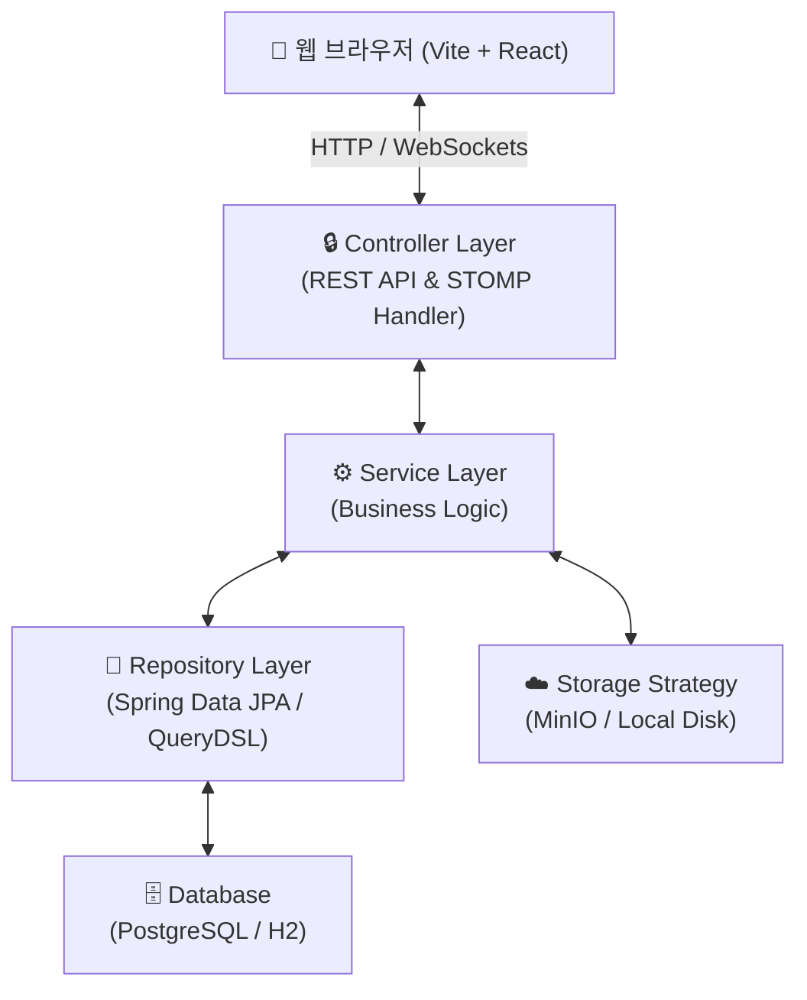
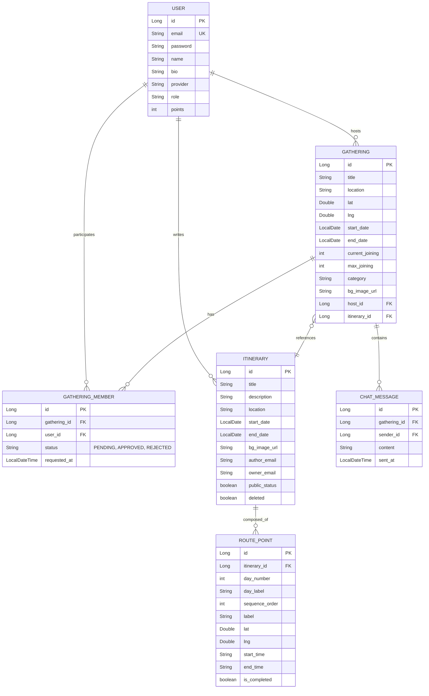

# TripGather 아키텍처 및 개발 가이드 🗺️ 🤝

이 문서는 TripGather 플랫폼의 시스템 아키텍처, 데이터 모델, 컴포넌트 구조, 로컬 실행 방법 및 문제 해결 가이드를 제공합니다.

---

## 🏗️ 1. 시스템 아키텍처 (System Architecture)

TripGather는 견고한 백엔드 안정성과 세련되고 몰입감 있는 프론트엔드 사용자 경험을 제공하기 위해 설계되었습니다.

### 1) 백엔드: 계층형 아키텍처 (Layered Architecture)
Spring Boot 3.3 기반의 전형적인 **계층형 아키텍처(Controller - Service - Repository)**를 준수하며, 외부 의존성과의 결합을 느슨하게 격리하도록 설계했습니다.



*   **API 계층 (Controller)**: RESTful API 설계 및 Spring Security + JWT를 이용한 인증/인가 처리를 수행합니다. 실시간 크루 무전망 기능은 WebSocket (STOMP) 프로토콜을 통해 처리됩니다.
*   **비즈니스 계층 (Service)**: 핵심 비즈니스 로직을 처리하며, 파일 저장 전략(`StorageStrategy`)의 전환(MinIO vs Local) 및 예외 처리 바운더리를 제공합니다.
*   **데이터 접근 계층 (Repository)**: Spring Data JPA를 바탕으로 복잡한 다이내믹 쿼리는 **QueryDSL**을 이용하여 컴파일 시점의 타입 안정성을 보장합니다.

### 2) 데이터 보존 및 무결성 관리
*   **BaseEntity & Auditing**: 엔티티의 생성 시간, 수정 시간, 생성자, 수정자를 자동으로 추적하는 JPA Auditing을 활용합니다.
*   **Soft Delete (논리 삭제)**: 모든 핵심 엔티티는 `deleted` 필드를 가지며, `@SQLRestriction("deleted = false")`를 적용해 휴지통에 넣은 데이터가 비즈니스 쿼리에 노출되지 않도록 투명하게 격리합니다.
*   **설정 격리**: `@EnableJpaAuditing`을 메인 Application 클래스에서 `JpaConfig`로 분리하여, 컨트롤러의 슬라이스 단위 테스트(`@WebMvcTest`) 실행 시 JPA 메타모델 로딩 실패로 인한 전체 테스트 격파 문제를 원천 방지합니다.

### 3) 프론트엔드: 반응형 Custom UI 시스템
Vite + React 19 기반의 단일 페이지 애플리케이션(SPA)으로, 다음과 같은 설계 사상을 가집니다.
*   **모바일 우선 (Mobile-First)**: 최대 너비 `480px`에 최적화된 모바일 뷰포트 레이아웃.
*   **글래스모피즘 (Glassmorphism)**: 투명하고 반사되는 유리 질감을 표현하는 `--glass-bg` 및 `backdrop-filter: blur(12px)` 테마.
*   **디자인 토큰**: `index.css`에 통합 정의된 컬러 토큰(`--primary-orange`, `--secondary-purple`, `--night-bg`)을 전격 활용하여 일관된 톤앤매너를 가집니다.

---

## 💾 2. 데이터 모델 (Data Model ERD)

TripGather는 모임(Gathering)에 참여하는 크루(Member), 그리고 모임에 결합되는 비행 계획(Itinerary)과 이동 경로(RoutePoint) 간의 관계를 다음과 같이 설계했습니다.



---

## 📂 3. 디렉토리 구조 (Directory Structure)

### 1) Backend (`/backend`)
```text
src/main/java/com/example/demo/
│
├── config/             # 보안, CORS, JPA, 웹소켓, 파일 업로드 관련 빈 설정
├── controller/         # REST API 및 웹소켓 엔드포인트 노출 계층
├── domain/             # JPA 엔티티 정의 (User, Gathering, Itinerary 등)
├── dto/                # 요청 및 응답 데이터 매핑 객체 (Request, Response)
├── exception/          # Global Exception Handler 및 에러 코드 관리
├── repository/         # Spring Data JPA 및 QueryDSL 인터페이스/구현체
└── service/            # 트랜잭션 및 비즈니스 핵심 로직 처리 계층
    └── storage/        # 파일 저장 전략 (MinioStorage vs LocalStorage)
```

### 2) Frontend (`/frontend`)
```text
src/
│
├── api/                # Axios 기반 API 클라이언트 및 공통 헤더 설정
├── components/         # 전역 공통 UI 및 레이아웃 컴포넌트
│   └── ui/             # 공통 UI 컴포넌트 (Card, TicketBase, PrimaryButton 등)
├── constants/          # 열거형 및 정적 상수 설정
├── contexts/           # 전역 상태 (인증, 사용자 정보, 실시간 알림) 관리
├── pages/              # 라우팅 단위 페이지 컴포넌트
├── stories/            # Storybook 용 컴포넌트 스토리
└── App.jsx             # React Router 7 및 Context Provider 통합 설정
```

---

## 🚀 4. 로컬 실행 가이드 (Local Run Guide)

### 1) 준비 사항
*   **Java**: JDK 17 이상
*   **Node.js**: v18.15.0 이상 (LTS 버전 권장)

### 2) 백엔드 실행
로컬 환경에서는 기본적으로 H2 인메모리 DB가 활성화되며, MinIO 등의 스토리지 서버 구동이 번거로울 경우 **로컬 파일 스토리지 모드**로 손쉽게 기동할 수 있습니다.

```bash
cd backend
# 로컬 스토리지 모드로 실행 (MinIO 컨테이너 실행 불필요)
./gradlew bootRun -Dstorage.type=local
```

*   **API Swagger UI**: [http://localhost:8080/swagger-ui.html](http://localhost:8080/swagger-ui.html)
*   **H2 데이터베이스 콘솔**: [http://localhost:8080/h2-console](http://localhost:8080/h2-console)
    *   **JDBC URL**: `jdbc:h2:mem:tripgather`
    *   **User Name**: `sa`
    *   **Password**: 없음 (공란)

### 3) 프론트엔드 실행
```bash
cd frontend
# 의존성 패키지 설치
npm install

# Vite 개발 서버 기동
npm run dev
```
*   **서비스 주소**: [http://localhost:5173](http://localhost:5173)

### 4) 테스트 사용자 로그인
`DataInitializer`에 의해 구동 시점에 다음 테스트 계정이 데이터베이스에 사전 등록됩니다.
*   **계정 1 (지현)**: `jihyun@test.com` / 비밀번호 `pass1234` (호스트용 샘플 데이터 보유)
*   **계정 2 (Alex)**: `alex@test.com` / 비밀번호 `pass1234` (참여자 및 챌린지 테스트 가능)

---

## 🛡️ 5. 테스트 및 품질 보증 (Testing & Coverage)

TripGather는 빌드 안정성 강화를 위해 서비스 계층의 단위 테스트 작성을 준수합니다.

```bash
cd backend
# 1. 테스트 스위트 실행
./gradlew test

# 2. JaCoCo 커버리지 리포트 생성
./gradlew jacocoTestReport
```

*   **커버리지 리포트 경로**: `backend/build/reports/jacoco/test/html/index.html` (웹 브라우저로 열람 가능)
*   **품질 표준**: `Service` 패키지의 비즈니스 로직 라인 커버리지는 **최소 80% 이상**으로 고정되어 있습니다.

---

## 🛠️ 6. 문제 해결 가이드 (Troubleshooting)

### Q1. 백엔드 기동은 성공했으나 파일 업로드 시 에러가 발생합니다.
*   **원인**: 기본 설정이 `STORAGE_TYPE=minio`로 지정되어 있으나, 로컬에 MinIO 오브젝트 스토리지 서비스가 구동되고 있지 않은 상태입니다.
*   **해결**: 실행 시 VM 옵션으로 `-Dstorage.type=local`을 전달하거나, `application.yml`의 `storage.type`을 `local`로 변경해 프로젝트 내부의 `.storage/` 폴더를 로컬 디스크 스토리지로 활용하세요.

### Q2. 컨트롤러 테스트(`@WebMvcTest`)가 JPA Context 로드 에러로 실패합니다.
*   **원인**: 메인 Application 클래스에 선언된 `@EnableJpaAuditing`이 슬라이스 테스트 구동 중 JPA 메타 모델을 탐색하려다 빈 등록 오류를 야기합니다.
*   **해결**: 본 프로젝트는 메인 클래스에서 `@EnableJpaAuditing`을 분리하고 `com.example.demo.config.JpaConfig` 파일을 신규 생성하여 이를 해결했습니다. 해당 리팩토링 규칙을 훼손하지 마십시오.

### Q3. 실시간 무전 채팅에서 메시지가 전송되거나 수신되지 않습니다.
*   **원인**: WebSocket 포트 충돌 또는 프론트엔드 환경 변수 오류.
*   **해결**: 브라우저 개발자 도구의 Network 탭에서 `ws-stomp` 통신 상태를 모니터링하세요. 백엔드 주소가 `http://localhost:8080/ws-stomp`로 정확하게 프록시 혹은 직접 커넥션 맺어지고 있는지 확인해야 합니다.
