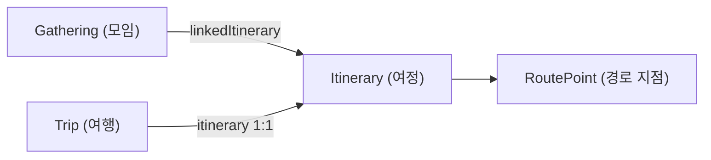
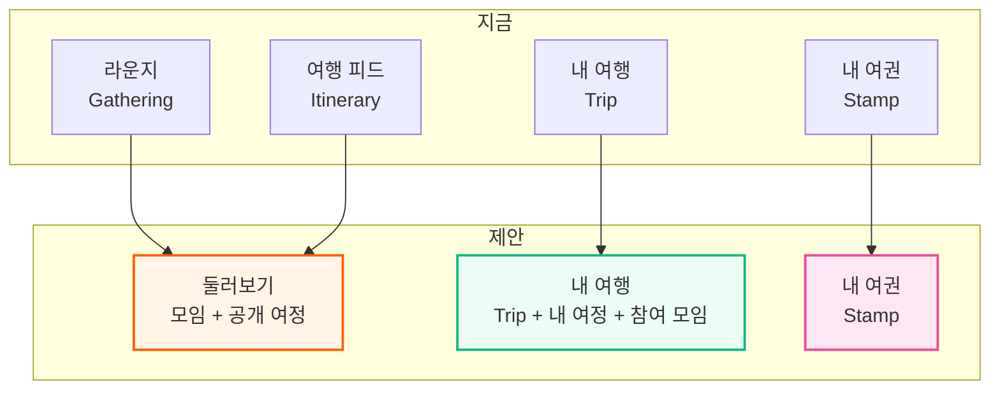

# UX 워크플로우 분석 및 개선 제안

> 현재 화면 구성이 왜 헷갈리는지, 무엇을 바꾸면 되는지 정리한 문서입니다.
> 코드 기준으로 확인한 사실과, 그로부터 도출한 제안을 구분해 적었습니다.

---

## 1. 현재 구조

### 탭이 보여주는 것

홈 화면은 4개 탭으로 나뉘어 있고, 각 탭은 **서로 다른 엔티티**를 보여줍니다.

| 탭 | 실제 데이터 | 범위 | API |
|:--|:--|:--|:--|
| 라운지 | `Gathering` | 전체 공개 | `GET /api/gatherings/search` |
| 여행 피드 | `Itinerary` | **전체 — 남의 공개 여정** | `GET /api/itineraries` |
| 내 여행 | `Trip` | 나만 | `GET /api/trips` |
| 내 여권 | `Stamp` | 나만 | `GET /api/stamps/me` |

### 엔티티 관계

`Itinerary`가 `Gathering`과 `Trip` 양쪽에 매달려 있는 것이 구조의 핵심이자, 혼란의 출발점입니다.

---

## 2. 무엇이 헷갈리는가

### 문제 1 — 탭 이름이 소유 관계를 말해주지 않는다

`라운지` / `여행 피드` / `내 여행` 세 이름만 보고는 **어느 것이 남의 것이고 어느 것이 내 것인지** 알 수 없습니다.

특히 **"여행 피드"는 내 여행이 아니라 남의 공개 여정 목록**입니다.
화면 안에 "다른 여행자들의 일정을 탐색하세요"라는 부제가 있지만, 탭 이름만으로는 반대로 읽히기 쉽습니다.
실제로 이 프로젝트를 만든 사람조차 헷갈렸다면, 처음 온 사용자는 더 그렇습니다.

### 문제 2 — "발견"이 두 탭으로 쪼개져 있다

`라운지`(모임 찾기)와 `여행 피드`(코스 찾기)는 사용자 입장에서 **둘 다 "뭐 재밌는 거 없나" 둘러보는 행동**입니다.
그런데 데이터 타입이 다르다는 이유로 탭이 분리되어 있습니다.
이것은 **사용자의 목적이 아니라 백엔드 엔티티 구조를 화면에 그대로 노출한 것**입니다.

### 문제 3 — 정기적인 활동을 표현할 수 없다

`Gathering`은 `startDate` / `endDate` 한 쌍과 `OPEN` / `CLOSED` 상태만 가집니다.
**반복(recurrence) 개념이 도메인에 전혀 없습니다.**

"우리 동네에서 매주 화요일 러닝"을 하려면 매주 새 모임을 만들고, 매번 크루를 새로 모으고, 매번 승인해야 합니다.
서비스 슬로건이 *"우리 동네에서 시작하는 새로운 여행"* 인데, 정작 **동네에서 반복되는 활동을 담을 그릇이 없습니다.**

---

## 3. 제안

### 3-1. 축을 바꾼다 — "데이터 종류"가 아니라 "발견 vs 내 것"

| 현재 | 제안 | 담기는 것 |
|:--|:--|:--|
| 라운지 + 여행 피드 | **둘러보기** | 모임과 공개 여정을 한 피드에서. 칩으로 `전체 / 모임 / 코스` 필터 |
| 내 여행 | **내 여행** | 내 Trip + 내 여정 + 참여 중인 모임 |
| 내 여권 | **내 여권** | 그대로 |

탭이 4개에서 3개로 줄고, 각 탭의 의미가 **"남의 것을 본다 / 내 것을 본다 / 내 기록을 본다"** 로 명확해집니다.

### 3-2. 정기편(Scheduled Flight)을 도입한다

기존 항공 메타포를 그대로 확장할 수 있습니다.

| 구분 | 항공 비유 | 의미 |
|:--|:--|:--|
| 일회성 모임 | **전세기 (Charter)** | 날짜가 정해진 한 번의 모임 — 지금과 동일 |
| 정기 모임 | **정기편 (Scheduled)** | "매주 화요일 19시 한강" 처럼 반복되는 모임 |

**도메인 변경은 크지 않습니다.** `Gathering`에 반복 규칙 필드 하나를 더하는 것으로 시작할 수 있습니다.

- 크루는 **한 번만 승인**받으면 이후 회차에 자동으로 포함됩니다
- 채팅방과 미션은 모임 단위로 유지되므로 회차마다 새로 만들 필요가 없습니다
- 스탬프는 **회차별로** 찍히므로, "이번 달 4회 참석" 같은 기록이 자연스럽게 쌓입니다

이것이 서비스의 차별점이 될 수 있습니다. 여행 앱은 많지만, **동네에서 반복되는 작은 활동을 여행처럼 기록해주는** 앱은 드뭅니다.

### 3-3. 이름을 여행답게

현재도 항공 메타포가 곳곳에 있지만(보딩패스, 무전, 여권) 탭 이름은 평범합니다. 일관성을 맞추면 몰입감이 올라갑니다.

| 지금 | 대안 | 이유 |
|:--|:--|:--|
| 둘러보기 | **게이트 (Gate)** | 출발 전 탐색하는 공간 |
| 내 여행 | **내 탑승권 (Boarding Pass)** | 이미 발권한 여정들 |
| 내 여권 | 내 여권 | 이미 좋음 |

다만 **은유가 기능 이해를 방해하면 안 됩니다.** 처음 온 사용자가 "게이트"를 보고 무엇을 하는 곳인지 모른다면 역효과입니다.
부제를 함께 두거나(`게이트 · 둘러보기`), A/B로 확인해보는 편이 안전합니다.

---

## 4. 우선순위

| 순위 | 항목 | 이유 | 규모 |
|:--:|:--|:--|:--|
| 1 | 여행 피드 → 둘러보기 통합 | 가장 큰 혼란의 원인. 프론트만 고쳐도 됨 | 중 |
| 2 | 탭 부제 추가 | 통합 전이라도 "남의 것/내 것"을 즉시 구분 가능 | 소 |
| 3 | 정기편 도입 | 서비스 차별점. 도메인·마이그레이션·UI 모두 필요 | 대 |
| 4 | 명칭 여행 테마화 | 몰입감 향상. 기능 이해도와 트레이드오프 확인 필요 | 소 |

**1번과 2번은 백엔드 변경 없이 가능합니다.** 3번은 별도 설계가 필요합니다.
