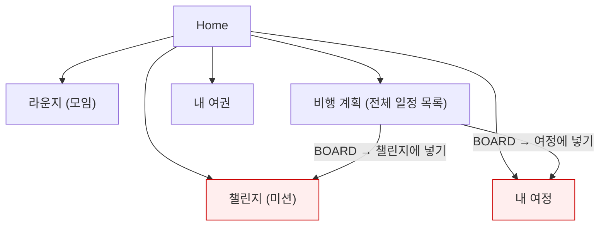
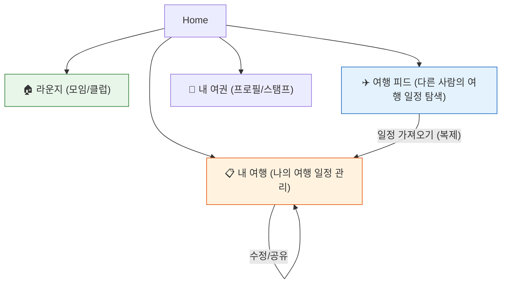
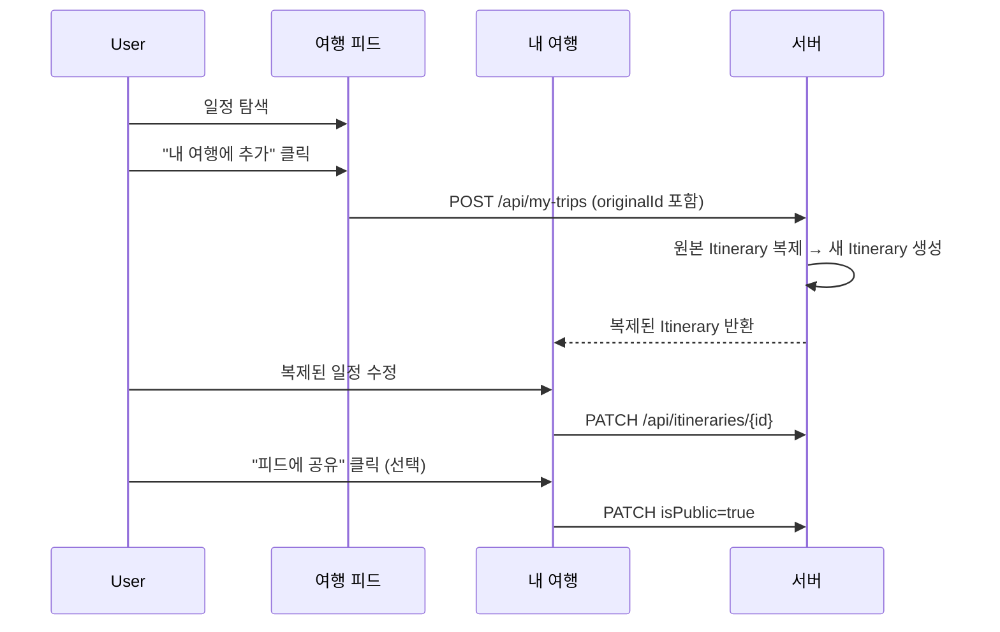

# TripGather 구조 재설계 기획안

## 현재 구조의 문제점

### 핵심 혼란 포인트
| 문제 | 설명 |
|---|---|
| **챌린지 ≒ 내 여정** | 둘 다 같은 Itinerary를 기반으로 하지만, "챌린지"는 스텝별 체크를, "내 여정"은 목록 보관을 담당 → 사용자가 어디에 넣어야 할지 매번 혼란 |
| **복제/수정 불가** | 다른 사람의 일정을 "내 여정"에 넣어도 **원본만 참조**할 뿐, 나만의 일정으로 수정 불가 |
| **모임과 여행의 분리 부재** | "라운지"는 모임, "비행 계획"은 여행 일정인데, UX상 두 도메인이 같은 레벨로 섞여있음 |

---

## 사용자의 핵심 니즈 (2가지)

### 니즈 1: 모임/클럽 활동 관리
> 달리기, 식사 등 모임 인원 모집 및 관리

- 현재 "라운지" 탭이 이 역할을 잘 수행중 ✅
- 개선 필요: 최소한의 수정으로 유지

### 니즈 2: 여행 일정 탐색 → 복제 → 수정 → 공유
> 다른 사람의 여행 일정을 보고, 내 일정으로 가져와서 자유롭게 수정

- 현재 구조에서 **전혀 불가능** ❌
- "챌린지"는 체크리스트일 뿐 수정 기능 없음
- "내 여정"은 원본 참조일 뿐 복제본 아님

---

## 제안하는 새 구조

### 탭 구성 (4개로 단순화)

| 탭 | 아이콘 | 역할 | 기존 대응 |
|---|---|---|---|
| **라운지** | 🏠 | 모임/클럽 목록, 생성, 참여 | 기존 "라운지" 유지 |
| **여행 피드** | ✈️ | 전체 여행 일정 탐색, 상세 보기 | 기존 "비행 계획" 리네이밍 |
| **내 여행** | 📋 | 나의 여행 일정 관리 (생성/복제/수정/삭제) | 기존 "내 여정" + "챌린지" 통합 |
| **내 여권** | 🛂 | 프로필, 스탬프 컬렉션, 포인트 | 기존 "내 여권" 유지 |

### "내 여행" 탭 상세 설계

> [!IMPORTANT]
> 이 탭이 이번 재설계의 핵심입니다.

#### 주요 기능

1. **새 여행 일정 추가** → 직접 작성 (현재 ItineraryEditorPage 활용)
2. **다른 사람 일정 가져오기** → "여행 피드"에서 "내 여행에 추가" 클릭 시 **복제본** 생성
3. **복제본 자유 수정** → RoutePoint 추가/삭제/순서 변경, 날짜 변경 등
4. **정렬/필터** → 시작일 순, 최근 추가 순
5. **삭제** → 내 여행에서 제거
6. **공유** → 수정한 나만의 일정을 "여행 피드"에 공개 (선택)

#### 데이터 흐름

---

## "챌린지" 탭 처리

> [!WARNING]
> "챌린지" 기능을 완전히 제거할지, "내 여행" 안에 통합할지 결정이 필요합니다.

### 옵션 A: 챌린지 완전 제거
- 가장 단순한 구조
- 스텝별 체크 기능이 사라짐 (방문 인증 등)

### 옵션 B: "내 여행" 안에 체크리스트 통합
- "내 여행"의 각 일정 상세에서 RoutePoint별 방문 체크 가능
- 별도 탭 없이 자연스럽게 통합
- **추천 방향** ✅

---

## 구현 시 필요한 백엔드 변경

| 변경 | 설명 |
|---|---|
| **Itinerary 복제 API** | `POST /api/my-trips` — 원본 ID를 받아 깊은 복사(RoutePoint 포함) 수행 |
| **소유권 구분** | 복제된 Itinerary에 `ownerId`, `originalId` 필드 추가 |
| **공개 여부** | `isPublic` 필드 추가 (피드에 노출 여부) |
| **기존 JourneyEntry 테이블** | 폐기 → 복제 기반으로 전환 |

---

## 질문 사항

1. **챌린지 기능**: 옵션 A(완전 제거) vs 옵션 B(내 여행 안에 체크리스트 통합) 중 어떤 방향을 원하시나요?
2. **여행 피드 공개**: 복제 후 수정한 나만의 일정을 다시 피드에 공유하는 기능이 필요한가요?
3. **모임(라운지)과의 연동**: 여행 일정과 모임을 연결하는 기능(예: "이 여행에 같이 갈 사람 모집")이 필요한가요?
